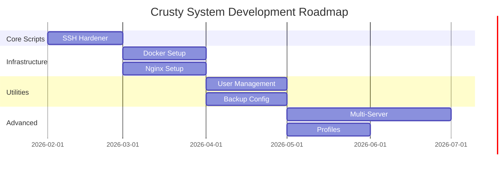

# Future Features Plan

This document outlines planned features and enhancements for the Crusty System project.

## Priority 1: Core Scripts

### SSH Hardener Script
**Status**: In Planning

**Features**:
- Custom SSH port (58432)
- ED25519 certificate generation
- UFW firewall configuration
- Fail2ban intrusion prevention
- Automatic weekly updates at 2:00 AM
- Certificate info output for SSH clients

**Implementation Notes**:
- See [SSH-HARDENER.md](../docs/SSH-HARDENER.md) for detailed specifications
- Must be idempotent
- Must backup existing configurations

---

## Priority 2: Infrastructure Scripts

### Docker Setup Script
**Status**: Planned

**Features**:
- Install Docker Engine
- Install Docker Compose
- Configure Docker daemon with security best practices
- Add specified user to docker group
- Configure Docker logging driver
- Set up Docker system prune cron job

**Configuration Options**:
- Docker version (latest or specific)
- Log driver (json-file, journald, etc.)
- Log rotation settings
- User to add to docker group

---

### Nginx Reverse Proxy Script
**Status**: Planned

**Features**:
- Install Nginx
- Configure as reverse proxy
- SSL/TLS setup with Let's Encrypt
- Security headers configuration
- Rate limiting
- WebSocket support

**Configuration Options**:
- Domain names
- SSL certificate type
- Upstream servers
- Custom security headers

---

## Priority 3: Utility Scripts

### User Management Script
**Status**: Planned

**Features**:
- Create users with secure defaults
- Configure sudo access
- Set up SSH keys for users
- Configure user-specific firewall rules

---

### Backup Configuration Script
**Status**: Planned

**Features**:
- Backup server configurations
- Backup to remote storage (S3, SFTP)
- Encryption of backups
- Retention policy management
- Backup verification

---

### Monitoring Setup Script
**Status**: Planned

**Features**:
- Install Node Exporter
- Configure Prometheus scraping
- Set up basic alerts
- Log rotation configuration

---

## Priority 4: Advanced Features

### Multi-Server Deployment
**Status**: Future

**Description**: Deploy configurations across multiple servers from a central management node.

**Features**:
- Inventory management
- Parallel execution
- Rollback capabilities
- Configuration drift detection

---

### Configuration Profiles
**Status**: Future

**Description**: Pre-defined security profiles for different use cases.

**Profiles**:
- **Minimal**: Basic hardening for development servers
- **Standard**: Balanced security for production servers
- **Maximum**: Maximum security for sensitive systems
- **Compliance**: CIS benchmark compliant configuration

---

### Web Dashboard
**Status**: Future

**Description**: Web-based dashboard for managing server configurations.

**Features**:
- Server inventory
- Configuration status
- Deployment history
- Scheduled tasks
- Alert management

---

## Implementation Timeline

## Contributing

Want to help implement these features? See [CONTRIBUTING.md](../CONTRIBUTING.md) for guidelines.

## Feature Requests

Have an idea for a new feature? Open an issue with the label `enhancement` and describe:
- The problem it solves
- Proposed solution
- Alternative approaches considered
