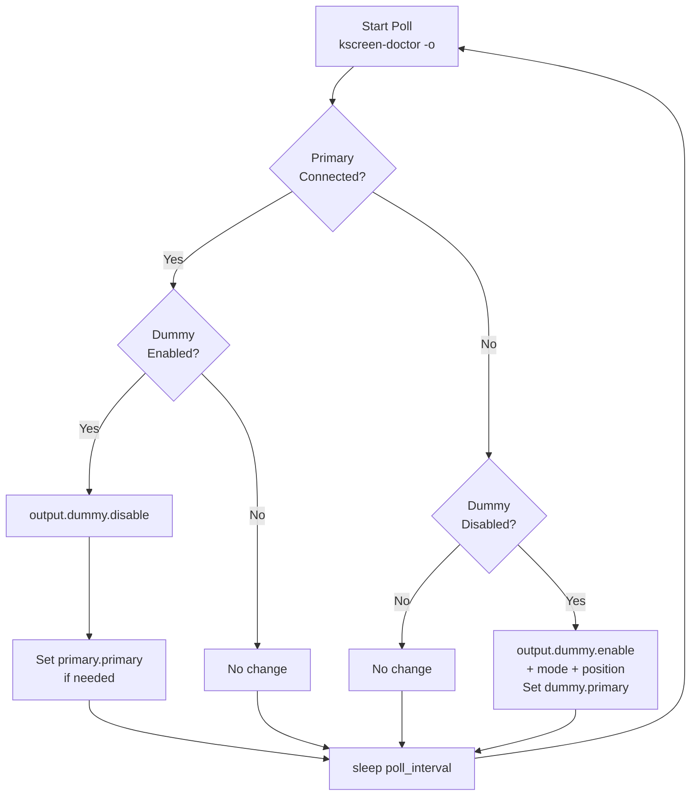

# Monitor Manager Plan

## Overview
Implement a user-space monitor management system for Arch/CachyOS (KDE Plasma Wayland) that:
- Automatically disables a configurable \"dummy\" output (headless monitor) when a configurable \"primary\" output is detected/connected.
- Re-enables the dummy output (sets position, mode, ensures primary) when primary is not detected.
- Runs as a systemd **user** service + timer (polling every 5s after 10s boot delay) to avoid root permission issues with kscreen-doctor.
- Installer script: `Arch/install-monitor-manager.sh` following `install-rustdesk.sh` style (colors, logging, root check, SUDO_USER handling).
- TUI setup using [`whiptail`](dialog package) for selecting primary/dummy from current outputs.
- Config: `~/.config/monitor-manager/config` (simple INI-like).
- Commands: `setup` (TUI config), `status` (show config/state), `uninstall`.
- One-line install: `curl ... | sudo bash`.
- Well-documented, user-friendly.

## Research Summary
- **Tool**: [`kscreen-doctor`](https://linuxcommandlibrary.com/man/kscreen-doctor) (part of kscreen package, standard in KDE Plasma).
  - List: `kscreen-doctor -o` → Parse lines like `Output: 123 HDMI-A-1 connected enabled priority 0`
  - Disable: `kscreen-doctor output.HDMI-A-1.disable`
  - Enable + config: `kscreen-doctor output.HDMI-A-1.enable output.HDMI-A-1.mode.0 output.HDMI-A-1.position.1920,0 output.DP-1.primary`
- **User service**: systemd --user, starts after graphical-session.target.
- **TUI**: [`whiptail`](https://linuxcommandlibrary.com/man/whiptail) (ncurses, install `dialog` if missing).
- **Dummy setup**: Assumes pre-existing (HDMI dummy plug or kernel `video=HDMI-A-1:1920x1080@60`). Script only manages enable/disable.
- **Issues**: kscreen-doctor requires Wayland session (user env), not root. Polling ok for 5s interval (low overhead).

## Config Format (`~/.config/monitor-manager/config`)
```
primary_output=DP-1
dummy_output=HDMI-A-1
dummy_mode=1920x1080@60  # Or mode ID from kscreen-doctor -o
dummy_position=1920,0    # Right of primary
poll_interval=5          # Seconds
```
- Parsed by bash `source` or `grep|cut`.

## Monitor Logic (`/usr/local/bin/monitor-manager.sh`)
Infinite loop:
1. `outputs=$(kscreen-doctor -o)`
2. Parse primary_status: grep \"${primary_output} .* connected\"
3. Parse dummy_status: grep enabled/disabled/connected for dummy.
4. If primary connected:
   - If dummy enabled → `kscreen-doctor output.${dummy_output}.disable`
   - Ensure primary: `output.${primary_output}.primary`
5. Else (primary not connected):
   - If dummy disabled → `kscreen-doctor output.${dummy_output}.enable output.${dummy_output}.mode.${dummy_mode} output.${dummy_output}.position.${dummy_position} output.${primary_output:-${dummy_output}}.primary`
6. `sleep $poll_interval`

**State Flow**



## Edge Cases
- **Flicker**: Only change if mismatch (check current state before apply).
- **No outputs**: Skip, log.
- **Same output selected**: TUI validate primary != dummy.
- **Initial setup**: Installer runs TUI if no config.
- **Multi-monitor**: Only manages primary + dummy; ignores others.
- **Mode ID**: TUI shows modes, user selects or hardcode common.
- **Uninstall**: `systemctl --user disable/stop timer/service`, rm files/config/bin.
- **Deps**: kscreen (auto in KDE), dialog (install if needed).

## File Structure
```
Arch/
├── install-monitor-manager.sh     # Installer (like rustdesk.sh)
plans/monitor-manager-plan.md      # This file
/usr/local/bin/
├── monitor-manager.sh             # Daemon logic
~/.config/monitor-manager/
├── config                        # User config
~/.config/systemd/user/
├── monitor-manager.service       # [Unit] After=graphical-session.target<br/>ExecStart=/usr/local/bin/monitor-manager.sh
├── monitor-manager.timer         # OnBootSec=10, OnUnitActiveSec=5s
```

## Installer Flow (`install-monitor-manager.sh`)
1. Root check.
2. sudo_user=${SUDO_USER}
3. Install deps: pacman -S --noconfirm dialog kscreen (if missing).
4. mkdir -p /usr/local/bin ~/.config/monitor-manager "${sudo_user home}/.config/systemd/user"
5. cp self to /usr/local/bin/monitor-manager-installer.sh? No, copy inline scripts.
6. Run TUI setup as sudo_user: parse `kscreen-doctor -o`, menus select primary/dummy/mode/pos.
7. Write config.
8. Write service/timer templates.
9. sudo -u $sudo_user systemctl --user daemon-reload enable --now monitor-manager.timer
10. Status summary.

**Args**: `setup|status|uninstall`

## README.md Updates
Add table row:
| `install-monitor-manager.sh` | Auto dummy monitor manager for headless KDE Wayland | Ready |

Section:
```
### Monitor Manager
One-line: `curl -sSL https://.../Arch/install-monitor-manager.sh | sudo bash`

**What it does:**
- Interactive TUI to select primary/dummy outputs.
- Sets up user systemd timer polling every 5s.
- Disables dummy when primary connected, enables otherwise.

Usage:
`sudo /usr/local/bin/install-monitor-manager.sh status`
```

## Next Steps
- Refine based on feedback.
- Implement in code mode.